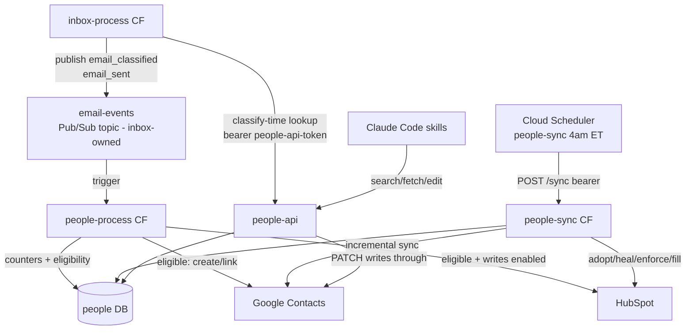

# people

People service: extracts contact handling out of `inbox` into its own
service. **Google Contacts is the source of truth** for who a person is; a
`people` Postgres index and a bounded HubSpot mirror are derived from it; a
`people-api` Cloud Run service serves person lookups to inbox (sender
context at classify time) and to Claude Code skills. Fed entirely by inbox's
`email_classified`/`email_sent` domain events — people never talks to
Microsoft Graph outside the local bulk-import script.

## How it works

Inbox classifies every email and, for mail Ben sends, publishes `email_sent`
too — both land on its `email-events` Pub/Sub topic. The `people-process`
Cloud Function turns each into counters and an eligibility check
(`services/ingest.py`, `services/eligibility.py`): not automated, and either
a non-`ignore` inbound email or an email from Ben. A newly-eligible person
gets a real Google Contact (`services/google_contacts_sync.py`) and, if
`HUBSPOT_WRITES_ENABLED`, a HubSpot contact bounded to `HUBSPOT_MAX_CONTACTS`
(`services/hubspot_mirror.py` — evicts the oldest managed contact before
creating past the cap). A nightly `people-sync` Cloud Function (Cloud
Scheduler, 4 AM America/New_York — before inbox's 5 AM sweep) pulls Google
Contacts' own changes via an incremental sync token, then reconciles HubSpot
(adopt/heal/enforce/fill). `people-api` reads the same DB plus Google
Contacts, and writes through `PATCH` edits to Google first — it never talks
to HubSpot or Graph.



Full design:
`docs/superpowers/specs/2026-09-03-people-service-extraction-design.md`.

## Project structure

```
main.py       CF entry points — process (Pub/Sub) and sync (HTTP), transport only
models/       EmailClassifiedEvent / EmailSentEvent TypedDicts, IngestResult
clients/      Google Contacts, HubSpot, Cloud SQL, OTel, local Graph import (I/O only)
repo/         DB read/write + schema.sql (people, sync_state tables)
services/     eligibility, ingest, google_contacts_sync, hubspot_mirror, person_edit, sync_auth
handlers/     email_classified, email_sent, sync — orchestration, called only from main.py
api/          people-api Cloud Run FastAPI service (main, auth, routers/people, routers/search)
scripts/      import_contacts.py, get_google_contacts_token.py, migrate_db.py,
              fetch-env.sh, test-api-local.py, link-skills.sh
terraform/    All GCP resources (state prefix: people)
docs/         design spec, implementation plan
.claude/      repo skills (architecture, deploy, logs, DB, secrets, observability, testing)
```

## Local development

```bash
python3.13 -m venv .venv && .venv/bin/pip install -r requirements-dev.txt
scripts/fetch-env.sh                 # .env from Secret Manager + terraform.tfvars
.venv/bin/pytest tests/ -q           # unit tests
```

Handler smoke tests against the real DB and API endpoints:

```bash
(set -a; source .env; set +a; .venv/bin/uvicorn api.main:app --port 8080)
.venv/bin/python scripts/test-api-local.py
```

See the `testing-people-handlers` and `verifying-pr-locally` skills for the
full local-verification workflow.

## Deployment

Push to `main` touching `main.py`, `clients/`, `models/`, `services/`,
`handlers/`, `repo/`, `requirements.txt`, or `terraform/` auto-deploys
`people-process`/`people-sync` via `.github/workflows/deploy.yml` (WIF →
`terraform apply`).

Push to `main` touching `api/`, `clients/`, `repo/`, `services/`, `models/`,
`Dockerfile`, or `requirements.txt` auto-deploys `people-api` via
`.github/workflows/deploy-api.yml` (build + push image, `gcloud run deploy`,
read-only post-deploy smoke).

Manual: `/deploy-people` skill.

## First-time setup

Neither workflow can bootstrap the stack on its own the very first time —
the Cloud Run service needs an image before Terraform can create it, and the
Google refresh token and HubSpot secret both need a human step. In order:

1. **Configuration.** `cd terraform && cp terraform.tfvars.example terraform.tfvars`
   and fill it in; set the GitHub secrets/variables the deploy workflows read
   (`GCP_WIF_PROVIDER`, `GCP_DEPLOYER_SA`, `HUBSPOT_OWNER_ID`,
   `OWN_ADDRESSES`, `AUTOMATED_SENDER_DOMAINS`).
2. **Import the existing HubSpot secret** (inbox terraform created it) and
   plan:
   ```bash
   terraform init
   terraform import google_secret_manager_secret.hubspot_token \
     projects/bens-project-462804/secrets/hubspot-token
   terraform apply -target=google_artifact_registry_repository.people
   ```
3. **Build and push the first `people-api` image** (Terraform can't create
   the Cloud Run service against an empty registry):
   ```bash
   gcloud auth configure-docker us-central1-docker.pkg.dev --quiet
   docker build -t us-central1-docker.pkg.dev/bens-project-462804/people/people-api:latest .
   docker push us-central1-docker.pkg.dev/bens-project-462804/people/people-api:latest
   ```
4. **Full apply** — creates the DB, secrets, both CFs, the scheduler job, and
   the Cloud Run service; outputs `people_api_url` and `sync_url`.
5. **Apply the schema and mint the Google refresh token**:
   ```bash
   PW=$(gcloud secrets versions access latest --secret people-db-password)
   CLOUD_SQL_CONNECTION_NAME=bens-project-462804:us-central1:inbox \
     POSTGRES_USER=people POSTGRES_PASSWORD="$PW" POSTGRES_DB=people \
     .venv/bin/python scripts/migrate_db.py

   GOOGLE_CLIENT_ID=$(gcloud secrets versions access latest --secret google-calendar-client-id) \
   GOOGLE_CLIENT_SECRET=$(gcloud secrets versions access latest --secret google-calendar-client-secret) \
   .venv/bin/python scripts/get_google_contacts_token.py
   # paste the printed refresh token:
   printf '%s' "<token>" | gcloud secrets versions add google-contacts-refresh-token --data-file=-
   ```
6. **First sync** — bootstraps `people` rows from every existing Google
   Contact (`HUBSPOT_WRITES_ENABLED` stays `false`, so the HubSpot counts
   come back zero — see "Phase C" in `CLAUDE.md`):
   ```bash
   SYNC_URL=$(cd terraform && terraform output -raw sync_url)
   curl -s -X POST "$SYNC_URL" \
     -H "Authorization: Bearer $(gcloud secrets versions access latest --secret people-sync-token)"
   ```
7. **Smoke test the API**:
   ```bash
   API=$(cd terraform && terraform output -raw people_api_url)
   PEOPLE_API_TOKEN=$(gcloud secrets versions access latest --secret people-api-token) \
     .venv/bin/python scripts/test-api-local.py --base "$API"
   ```

After that, send a real email to confirm Gate A: a fresh inbound email
produces a `people` row and (if eligible) a Google Contact, and
`GET /people/{email}` returns it.

Full design: `docs/superpowers/specs/2026-09-03-people-service-extraction-design.md`.
